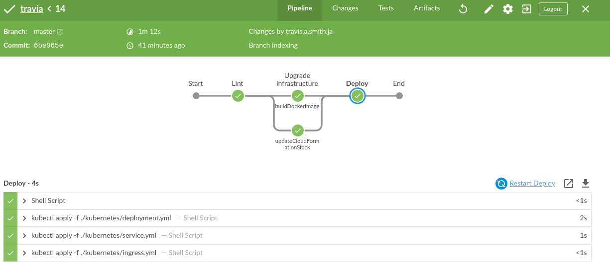
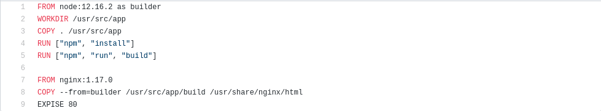
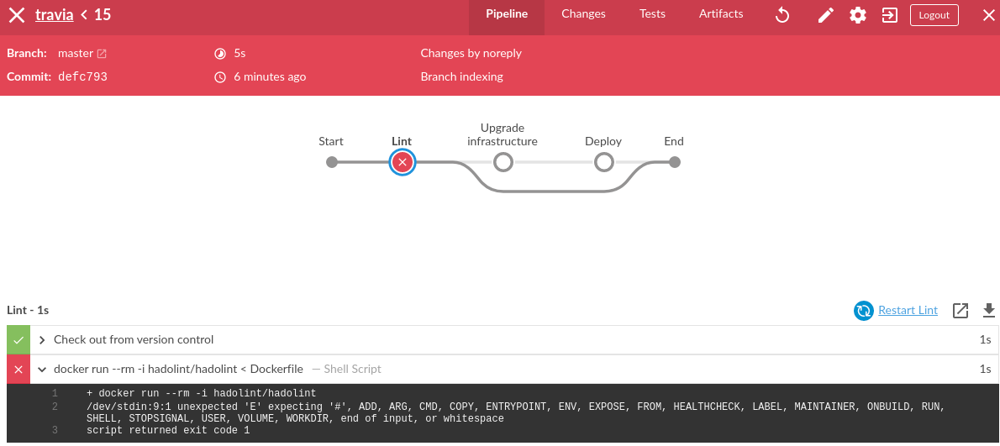
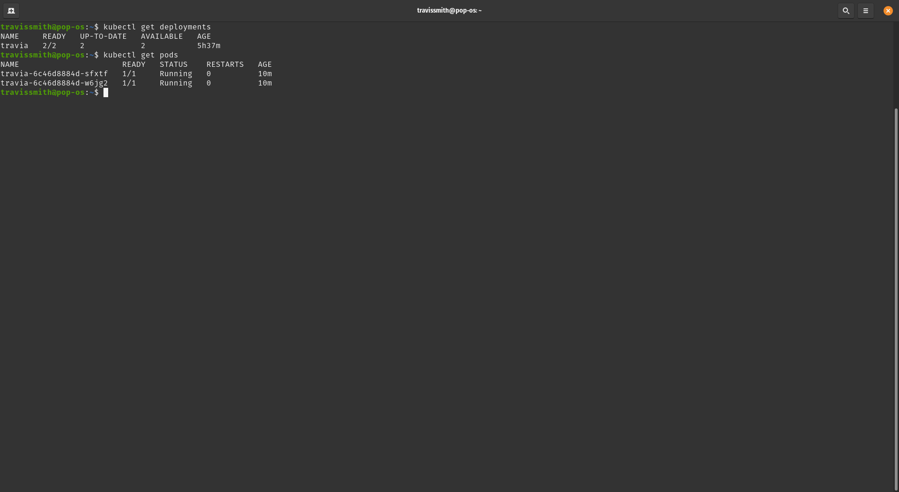

<html>
<body>
    
    
Travia is a simple trivia game implemented as the final project of the <a href="https://www.udacity.com/course/cloud-dev-ops-nanodegree--nd9991">Udacity Cloud Dev Ops Nanodegree</a>.

    <h2>The Game</h2>
    <a href="https://travia.travisalexandersmith.me/">Live Demo</a>
    
The objective of the game is to gain as many points as possible within 5 minutes. Players are awarded points for each question answered. The number of points awarded dependeds on the difficulty of the question. As in the table: 

    <table>
     <tr>
        <td>Easy</td>
        <td>1 point</td>
     </tr>
     <tr>
        <td>Medium</td>
        <td>2 points</td>
     </tr>
     <tr>
        <td>Hard</td>
        <td>3 points</td>
     </tr>
    </table>
    <h2>Implementation</h2>
    
The application is built using TypeScript and ReactJS. The questions are pulled from <a href="https://opentdb.com/">Open Trivia Database</a>.

    <h2>Docker</h2>
    
The Dockerfile in this repository makes use of multi-stage builds to first build the application using node and then deploy the production-ready build on an Nginx instance. Built docker images are pushed to <a href="https://hub.docker.com/repository/docker/travissmith94/travia">Dockerhub</a>.

    <h2>CloudFormation</h2>
    
Within the cloudformation folder of this repository is a pair of yml files used to provision the infrastructure for the <a href="https://aws.amazon.com/eks/">Amazon EKS</a> Cluster that will run this application.

    <h2>Kubernetes</h2>
    
The yml files within the kubernetes folder of this repository will deploy the version of this application when applied to a Kubernetes cluster. <code>&#x3C;tag&#x3E;</code> must be replaced by the version of the application to be deployed.

    <h2>Jenkins</h2>
    
The Jenkinsfile included in this repository describes a pipeline used to build and deploy this application.

    
    <h3>Steps</h3>
    <ol>
        <li>Linting</li>
        
In the linting step <a href="https://github.com/hadolint/hadolint">Hadolint</a> is used to lint the Dockerfile.

        
Given an error in the Dockerfile, such as the incorrectly spelt <code>EXPOSE below.</code>The Jenkins build will report a failure.

        </img>
        <li>Upgrade Infrastructure</li>
        
This step completes 2 tasks in parallel. It updates the CloudFormation stacks with any changes that have been made to the templates and it builds and pushes a new version of the Docker image

        <li>Deploy</li>
        This step sets the tag within the kubernetes deployment manifest within the kubernetes folder of this repository to the value latest push docker image and applies all kubernetes manifests within the folder to the EKS Cluster using kubectl.
    </ol>
    <h2>Results</h2>
    Kubernetes pods after a successful deployment.
    
    EC2 Console with resources used to build and host this project.
    
</body>
</html>